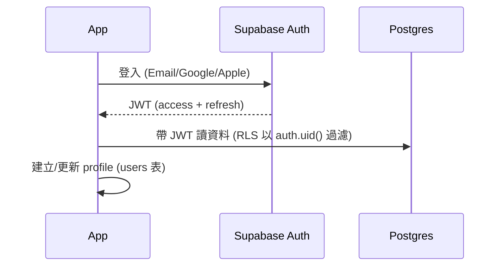

# 04 — 系統架構

## 1. 全景

```mermaid
flowchart TB
  subgraph Client["📱 Expo App (iOS / Android)"]
    UI["畫面 (Expo Router)"]
    Q["TanStack Query / Zustand"]
    RC["RevenueCat SDK"]
    SB["Supabase JS Client"]
    UI --> Q --> SB
    UI --> RC
  end

  subgraph Supabase["☁️ Supabase"]
    Auth["Auth (JWT)"]
    PG[("Postgres + RLS")]
    RT["Realtime"]
    ST["Storage (收據)"]
    EF["Edge Functions (Deno/TS)"]
  end

  Store["App Store / Google Play 內購"]
  RCB["RevenueCat 後端"]

  SB -->|讀 (RLS 保護) / 呼叫 RPC| PG
  SB --> Auth
  SB --> RT
  SB --> ST
  Q -->|寫入類/需伺服器邏輯| EF --> PG
  RC --> Store --> RCB -->|Webhook 更新 entitlement| EF --> PG
  RT -.即時推送.-> Q
```

**核心原則**：讀取可經 Supabase client 直連 (受 RLS 保護)；**所有涉及金額計算的寫入走伺服器權威路徑** (Edge Function 或 Postgres RPC)，client 不做可信任的金額結論。

## 2. Monorepo 佈局

```
splitify/
├── apps/
│   └── mobile/                 # Expo App
│       ├── app/                # Expo Router 檔案式路由 (畫面)
│       ├── src/
│       │   ├── features/       # 依功能垂直切分 (見下)
│       │   ├── components/     # 共用 UI 元件
│       │   ├── lib/            # supabase client, revenuecat, query client
│       │   └── i18n/
│       └── CLAUDE.md
├── packages/
│   ├── core/                   # 純 TS 商業邏輯 (無 I/O)：拆帳、餘額、簡化債務、金額運算
│   │   ├── src/
│   │   └── CLAUDE.md
│   ├── shared/                 # Zod schema + 型別 + 常數 (幣別/分類)
│   │   └── CLAUDE.md
│   └── config/                 # tsconfig / eslint / prettier 共用
├── supabase/
│   ├── migrations/             # DB schema + RLS (版本化 SQL)
│   ├── functions/              # Edge Functions
│   │   ├── create-expense/
│   │   ├── settle-up/
│   │   ├── simplify-debts/
│   │   └── revenuecat-webhook/
│   └── CLAUDE.md
├── docs/
├── CLAUDE.md
├── turbo.json
└── pnpm-workspace.yaml
```

### 功能垂直切分 (feature-based)
`apps/mobile/src/features/<feature>/` 內含該功能的畫面片段、hooks (呼叫 API/Query)、元件、型別。**agent 友善**：一個功能改動集中在一個資料夾。範例 feature：`auth` / `groups` / `expenses` / `balances` / `settlements` / `friends` / `activity` / `premium`。

## 3. 前端架構

- **路由**：Expo Router (檔案式)，`app/` 目錄對應畫面；用 group route 分 `(tabs)` / `(auth)` / `(modal)`。
- **資料層**：所有伺服器互動包成 hooks (`useGroup`, `useCreateExpense`…) 用 TanStack Query；mutation 後 invalidate 相關 query，並可樂觀更新。
- **本地狀態**：Zustand 存少量 UI/暫存 (例如記帳表單草稿、主題)。
- **型別/驗證**：表單以 `packages/shared` 的 Zod schema 驗證，送出前先過 schema。
- **金額顯示**：一律用 `packages/core` 的格式化函式 (依幣別 exponent) 把整數 minor units 轉成顯示字串；**不在畫面裡直接除以 100 之類**。

## 4. 後端架構 (Supabase)

- **Auth**：Supabase Auth 發 JWT；RLS policy 以 `auth.uid()` 判斷。支援 Email、Google、Apple；Line 登入後期以 custom / OAuth 方式接。
- **Postgres + RLS**：資料表見 [05](05-data-model.md)。每張含使用者資料的表都有 policy：使用者只能存取自己所屬群組/好友關係的資料。
- **Edge Functions (Deno/TS)**：承載需伺服器權威或第三方整合的邏輯：
  - `create-expense` / `update-expense`：驗證拆帳加總正確、寫入 expense + splits (交易)。
  - `settle-up`：記錄結算並更新餘額視圖依賴。
  - `simplify-debts`：計算最小轉帳建議。
  - `revenuecat-webhook`：接收訂閱事件，更新 `entitlements`。
  - `ocr-receipt` (Pro)：呼叫 OCR，回傳結構化品項。
  - Edge Function **import `packages/core`** 來做拆帳/餘額運算 → 前後端同一套邏輯。
- **Postgres function (RPC)**：純資料計算 (如餘額彙總) 可用 SQL function / view，效能好、靠近資料。
- **Realtime**：訂閱群組的 `expenses` / `settlements` / `activity` 變動，推給在線成員。
- **Storage**：收據圖片，bucket 以群組/使用者為單位，配 RLS/簽名 URL。

### 商業邏輯放哪 (重要)
| 邏輯 | 位置 |
|---|---|
| 純計算 (拆帳分配、餘額、簡化債務、金額格式化) | `packages/core` (純 TS，無 I/O，高覆蓋單元測試) |
| 需交易/驗證的寫入 | Edge Function (呼叫 `core` 計算 + 寫 DB 交易) |
| 授權 (誰能看/改) | Postgres RLS |
| 彙總查詢 | Postgres view / RPC |

## 5. 認證流程



## 6. 即時同步與離線

- **即時**：MVP 用 Supabase Realtime 訂閱當前群組的變動，收到即 invalidate/更新 Query 快取。
- **離線 (V1+)**：TanStack Query 持久化快取先讓「讀」可離線；離線「寫」佇列與衝突處理列為後期強化 (帳務衝突需謹慎，MVP 先要求連線寫入)。

## 7. 安全模型 (摘要，細節見 05 與 09)

- 多租戶隔離：**Postgres RLS 為最後防線**，client 過濾只是體驗。
- 金額寫入伺服器驗證：Edge Function 檢查 splits 加總 == 總額、幣別一致、成員屬於群組。
- Secrets：service role key、OCR/第三方金鑰只存在 Edge Function 環境變數，**絕不進 App bundle**。
- Storage：私有 bucket + 簽名 URL；收據僅群組成員可讀。
- 付費解鎖以**伺服器端 entitlement (由 RevenueCat webhook 寫入)** 為準，App 端判斷僅為體驗，不可作為唯一防線。

## 8. 環境設定

- 三環境 (dev / staging / prod) 各一個 Supabase 專案；金鑰用 Expo 的 env / EAS secrets 管理。詳見 [09](09-deployment.md)。
