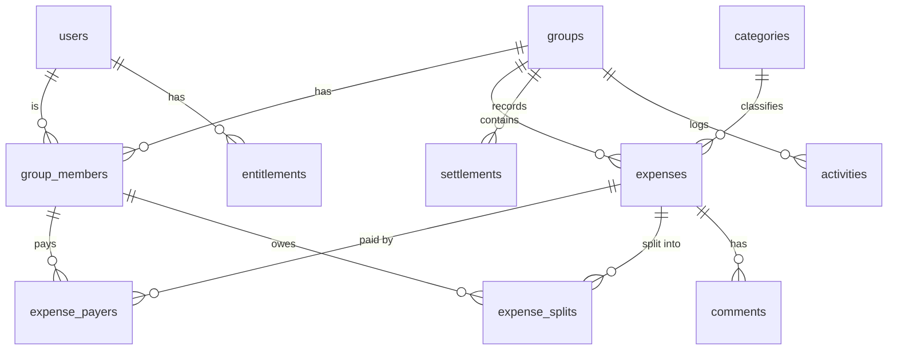

# 05 — 資料模型與核心演算法

> 以下 SQL 為**設計草案**，實際以 `supabase/migrations/` 為準。命名用 `snake_case`，時間欄用 `timestamptz`，主鍵用 `uuid` (預設 `gen_random_uuid()`)。

## 1. 金額表示 (務必遵守)

- 金額欄位型別 **`bigint`**，存**最小貨幣單位** (minor units)。
- 每個帶金額的實體都有 `currency` (ISO 4217，如 `TWD`/`JPY`/`USD`)。
- 幣別的小數位 (exponent) 由 `packages/shared` 的常數表決定：`TWD`→0、`JPY`→0、`USD`→2…。顯示時由 `packages/core` 依 exponent 轉換，**程式碼中不出現魔法數字 100**。
- 禁止 `float`/`double`；所有分配計算為整數運算 + 明確餘數規則 (見 §5)。

## 2. ERD



`expenses.group_id` 可為 null → 代表**好友間 1:1** 非群組帳目 (以 `friendships` 界定關係)。

## 3. 資料表 (草案)

```sql
-- 使用者檔案 (id 對應 auth.users.id)
create table users (
  id uuid primary key references auth.users(id) on delete cascade,
  display_name text not null,
  email text,
  avatar_url text,
  default_currency text not null default 'TWD',
  created_at timestamptz not null default now()
);

-- 群組
create table groups (
  id uuid primary key default gen_random_uuid(),
  name text not null,
  type text not null default 'general', -- trip | home | couple | general
  default_currency text not null default 'TWD',
  simplify_debts boolean not null default true,
  cover_url text,
  created_by uuid not null references users(id),
  created_at timestamptz not null default now(),
  archived_at timestamptz
);

-- 群組成員 (可為已註冊 user，或尚未註冊的佔位成員 placeholder)
create table group_members (
  id uuid primary key default gen_random_uuid(),
  group_id uuid not null references groups(id) on delete cascade,
  user_id uuid references users(id),          -- null = 佔位成員
  display_name text not null,                  -- 佔位/群內暱稱
  role text not null default 'member',         -- admin | member
  invited_email text,
  joined_at timestamptz not null default now(),
  unique (group_id, user_id)
);

-- 好友 (1:1 非群組)
create table friendships (
  id uuid primary key default gen_random_uuid(),
  user_id uuid not null references users(id) on delete cascade,
  friend_id uuid not null references users(id) on delete cascade,
  status text not null default 'active',       -- pending | active | blocked
  created_at timestamptz not null default now(),
  unique (user_id, friend_id)
);

-- 分類 (group_id null = 系統內建；非 null = 該群組自訂[Pro])
create table categories (
  id uuid primary key default gen_random_uuid(),
  group_id uuid references groups(id) on delete cascade,
  key text not null,        -- food | transport | lodging | ...
  label text not null,
  icon text,
  sort int not null default 0
);

-- 帳目
create table expenses (
  id uuid primary key default gen_random_uuid(),
  group_id uuid references groups(id) on delete cascade,  -- null = 好友 1:1
  description text not null,
  total_amount bigint not null,          -- minor units, > 0
  currency text not null,
  category_id uuid references categories(id),
  expense_date date not null default current_date,
  split_type text not null,              -- equal | exact | percentage | shares | itemized | adjustment
  split_config jsonb,                    -- 各拆帳法的原始設定 (%、shares、明細…)
  receipt_url text,
  notes text,
  recurring_rule jsonb,                  -- null = 一次性；否則排程規則 [V1/Pro]
  created_by uuid not null references users(id),
  created_at timestamptz not null default now(),
  updated_at timestamptz not null default now(),
  deleted_at timestamptz                 -- 軟刪除
);

-- 付款人 (支援多付款人)；sum(paid_amount) 必須 == expenses.total_amount
create table expense_payers (
  expense_id uuid not null references expenses(id) on delete cascade,
  member_id uuid not null references group_members(id) on delete cascade,
  paid_amount bigint not null,
  primary key (expense_id, member_id)
);

-- 拆帳 (誰分攤多少)；sum(owed_amount) 必須 == expenses.total_amount
create table expense_splits (
  expense_id uuid not null references expenses(id) on delete cascade,
  member_id uuid not null references group_members(id) on delete cascade,
  owed_amount bigint not null,           -- 由 core 依 split_type 計算後落地
  primary key (expense_id, member_id)
);

-- 結算 (記錄 from 付給 to；不經手真實資金)
create table settlements (
  id uuid primary key default gen_random_uuid(),
  group_id uuid references groups(id) on delete cascade,
  from_member uuid not null references group_members(id),
  to_member uuid not null references group_members(id),
  amount bigint not null,
  currency text not null,
  method text,                            -- cash | linepay | transfer | other
  note text,
  settled_at timestamptz not null default now(),
  created_by uuid not null references users(id)
);

-- 帳目留言 [V1]
create table comments (
  id uuid primary key default gen_random_uuid(),
  expense_id uuid not null references expenses(id) on delete cascade,
  author_id uuid not null references users(id),
  body text not null,
  created_at timestamptz not null default now()
);

-- 活動時間軸
create table activities (
  id uuid primary key default gen_random_uuid(),
  group_id uuid references groups(id) on delete cascade,
  actor_id uuid references users(id),
  type text not null,                     -- expense_added | expense_edited | settled | member_joined | ...
  payload jsonb,
  created_at timestamptz not null default now()
);

-- 訂閱權益 (由 RevenueCat webhook 寫入；解鎖以此為準)
create table entitlements (
  user_id uuid primary key references users(id) on delete cascade,
  tier text not null default 'free',      -- free | pro
  status text,                            -- active | trial | expired | grace
  store text,                             -- app_store | play_store
  expires_at timestamptz,
  updated_at timestamptz not null default now()
);

-- 推播 token
create table push_tokens (
  id uuid primary key default gen_random_uuid(),
  user_id uuid not null references users(id) on delete cascade,
  token text not null,
  platform text not null,                 -- ios | android
  created_at timestamptz not null default now(),
  unique (user_id, token)
);
```

**建議約束/索引**：`expenses(group_id, expense_date)`、`expense_splits(member_id)`、`settlements(group_id)`、`activities(group_id, created_at)`；用 CHECK 保證 `total_amount > 0`。加總相等 (payers/splits == total) 由 Edge Function 於交易內驗證 (跨列約束用 trigger 亦可)。

## 4. 佔位成員 (placeholder) 綁定

- 邀請未註冊者：建立 `group_members` 且 `user_id = null`、填 `display_name` / `invited_email`。
- 對方註冊後，透過邀請連結或 email 比對，把該 `group_member.user_id` 綁定到新 `users.id`；歷史帳目自動歸屬。

## 5. 拆帳演算法 (`packages/core`)

輸入：`total_amount` (bigint)、成員清單、`split_type`、`split_config`。輸出：每位成員 `owed_amount` (bigint)，且 **Σ owed == total**。

- **equal**：`base = total / n` (整數除)，餘數 `r = total - base*n`；把多出的 1 單位依**穩定排序** (member_id) 分給前 `r` 位。
  - 例：`100 / 3` → `[34, 33, 33]` (r=1 給第一位)。
- **exact**：直接用指定金額，驗證 `Σ == total`，否則報錯。
- **percentage**：`owed_i = round(total * pct_i)`，用**最大餘數法 (largest remainder)** 調整使 `Σ == total`；驗證 `Σ pct == 100%`。
- **shares**：`owed_i = total * share_i / Σshares`，同樣最大餘數法補足餘數。
- **itemized [Pro]**：各明細各自算完再彙總到成員。
- **adjustment**：先均分，再依每人固定調整額增減，餘數再平衡。

> 餘數分配規則必須**確定性且可測**：同輸入永遠同輸出。`packages/core` 對每種拆帳法都要有單元測試涵蓋整除、不整除、極端 (1 人、金額為 0 邊界) 情況。

## 6. 餘額計算

每位成員在群組的**淨額 (net)**：

```
net(member) =  Σ paid_amount (該成員付出的)
             − Σ owed_amount (該成員該分攤的)
             + Σ settlements.amount (該成員 as from_member 付出的結算 → 負債減少,net 上升)
             − Σ settlements.amount (該成員 as to_member 收到的結算)
```

`net > 0` → 別人淨欠他；`net < 0` → 他淨欠別人。同群組所有成員 `Σ net == 0` (可作為稽核不變量測試)。

**跨幣別**：MVP 內部以群組主幣別彙總；多幣別自動換算為 [Pro]，換算率與換算時點需保存以利稽核。

實作：以 Postgres view / RPC 彙總 (效能佳)，或 `packages/core` 由原始資料計算 (可測)。兩者結果必須一致，用測試對拍。

## 7. 「誰欠誰」與簡化債務 (simplify debts)

- **未簡化**：由每筆 expense 的 payer↔split 關係累加出成對債務 (A 欠 B 多少)。
- **簡化 (V1)**：把群組淨額拆成「債務人 (net<0)」與「債權人 (net>0)」兩池，用貪婪法 (每次拿最大債務人配最大債權人) 產生**最少筆數**的轉帳建議，直到全部歸零。
  - 這是經典 min-cash-flow 問題；貪婪解不保證理論最小，但實務足夠且穩定；需單元測試 (含金額守恆：建議轉帳總額 == 債務總額)。
- 群組 `simplify_debts` 開關決定結算頁顯示「原始成對債務」或「簡化建議」。

## 8. RLS 授權策略

原則：**使用者只能存取自己所屬群組 / 好友關係內的資料**。

- `groups` / `expenses` / `settlements` / `activities` / `comments`：SELECT 條件 = 「存在一筆 `group_members` 使 `user_id = auth.uid()` 且屬同群組」。
- 寫入：一般寫入走 Edge Function (service role) 並在函式內做授權與金額驗證；若允許 client 直接寫，需對應 INSERT/UPDATE policy。
- `users`：本人可改自己；同群組成員可讀彼此基本檔案 (顯示名/頭像)。
- `entitlements`：本人唯讀；只有 webhook (service role) 可寫。
- `push_tokens`：本人可增刪自己的 token。

> RLS 是**最後防線**，即使 client 有 bug 也不能越權。每張表都要有測試驗證「非成員讀不到」。

## 9. 稽核不變量 (拿來寫測試)

1. 每筆 expense：`Σ expense_payers.paid == total_amount` 且 `Σ expense_splits.owed == total_amount`。
2. 每個群組:所有成員 `Σ net == 0`。
3. 簡化債務建議：`Σ 建議轉帳 == Σ 債務`，且套用後所有 net → 0。
4. 幣別一致:同一 expense 內 payers/splits/total 同幣別。
