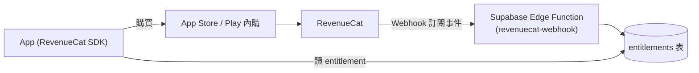

# 06 — 變現模式 (Freemium)

## 1. 策略

**免費層要比 Splitwise 更佛**（吃它加每日記帳上限、塞廣告的不滿），把付費點放在**省時 / 專業 / 進階**功能，不擋核心體驗。護城河是體驗 + 在地整合，價格只是輔助。

## 2. 分級：Free vs Splitify Pro

| 功能 | Free | Pro |
|---|---|---|
| 群組 / 帳目數量 | **無限** | 無限 |
| 每日記帳次數 | **無限** (差異化重點) | 無限 |
| 基本拆帳 (均分 / 指定金額 / % / 份數) | ✅ | ✅ |
| 結算、活動時間軸、好友、推播 | ✅ | ✅ |
| 收據照片上傳 | ✅ (基本張數) | ✅ (更多/更久) |
| 深色模式 | ✅ | ✅ |
| 廣告 | 無惱人廣告 (見 §5) | 無 |
| **AI 收據掃描 (OCR 自動入帳)** | — | ✅ |
| **消費分析圖表 / 洞察** | — | ✅ |
| **匯出 CSV / PDF** | — | ✅ |
| **多幣別自動匯率換算** | — | ✅ |
| **定期帳單 (recurring)** | — | ✅ |
| **逐項/明細拆帳 (itemized)** | — | ✅ |
| **自訂分類 / 主題** | — | ✅ |
| 進階搜尋 / 篩選 | — | ✅ |
| 優先客服 | — | ✅ |

> 分級可依數據調整。原則：**免費夠用到會留下、會邀朋友**；**Pro 讓重度/旅遊/室友長期用戶願意付**。

## 3. 定價 (草案，需 A/B)

- 台灣：Pro 月訂閱約 **NT$60–90**，年訂閱約 **NT$600–800** (等於買 8–10 個月送 2–4 個月)。
- 提供 **7 天免費試用**；年繳為主推 (現金流與留存較好)。
- 定位**低於 Splitwise Pro**，強化價格優勢。
- 其他市場依 App Store / Play 的在地價目表 (price tiers) 對應。

## 4. 技術架構：RevenueCat + 平台內購

- App 用 **RevenueCat SDK** 發起購買、查詢目前 entitlement。
- RevenueCat 以 **Webhook** 把訂閱事件 (購買/續訂/取消/退款/進入寬限期) 送到 Edge Function，寫入 `entitlements` 表。
- **解鎖以伺服器端 `entitlements` 為準**；App 端判斷僅為體驗流暢，不可作為唯一防線 (防破解)。
- 定義一個 entitlement，例如 `pro`；Pro 功能入口在無權益時顯示 **paywall**。

## 5. 廣告立場

- 傾向 **免費版不放 / 只放極輕量、不打斷體驗的廣告**，作為對 Splitwise 的差異化賣點。
- 若日後要補營收，考慮「非侵入式」形式，並讓 Pro 免廣告。預設**先不做廣告**，靠訂閱轉換。

## 6. 平台規則注意事項 (務必遵守)

- **數位訂閱必須走 Apple / Google 內購**，不得在 App 內用 Stripe/信用卡直接收數位功能費用，否則會被退件/下架。
- 抽成：加入 **App Store Small Business Program / Google Play** 的小型企業方案 (年營收 < US$1M) 為 **15%**，否則 30%。→ 上架初期記得申請。
- 需提供**恢復購買 (Restore Purchases)**、清楚的訂閱條款、隱私政策連結 (審核必查)。
- iOS 若有第三方登入，且提供 Google 登入，通常**需一併提供 Apple Sign-in**。

## 7. 後期：Web + Stripe (降低抽成)

- 推出 Web 版後，可在**網頁用 Stripe 銷售訂閱** (不被平台抽成)，App 內認列同一 entitlement (Netflix/Spotify 模式)。
- 需統一 entitlement 來源 (RevenueCat 可整合 Stripe，或自建對應)，避免雙頭帳。

## 8. 轉換漏斗要點

- **價值先行**：讓用戶先用免費版把帳記起來、把朋友邀進來，累積切換成本。
- **情境式 paywall**:在使用者「正想匯出 / 想掃收據 / 想看分析」的當下觸發，比首開 App 就擋更有效。
- **試用 → 付費**:試用到期前推播提醒;年繳優惠明顯。
- 追蹤:免費→Pro 轉換率、試用轉付費、各 paywall 入口轉換 (用 PostHog 事件)。
